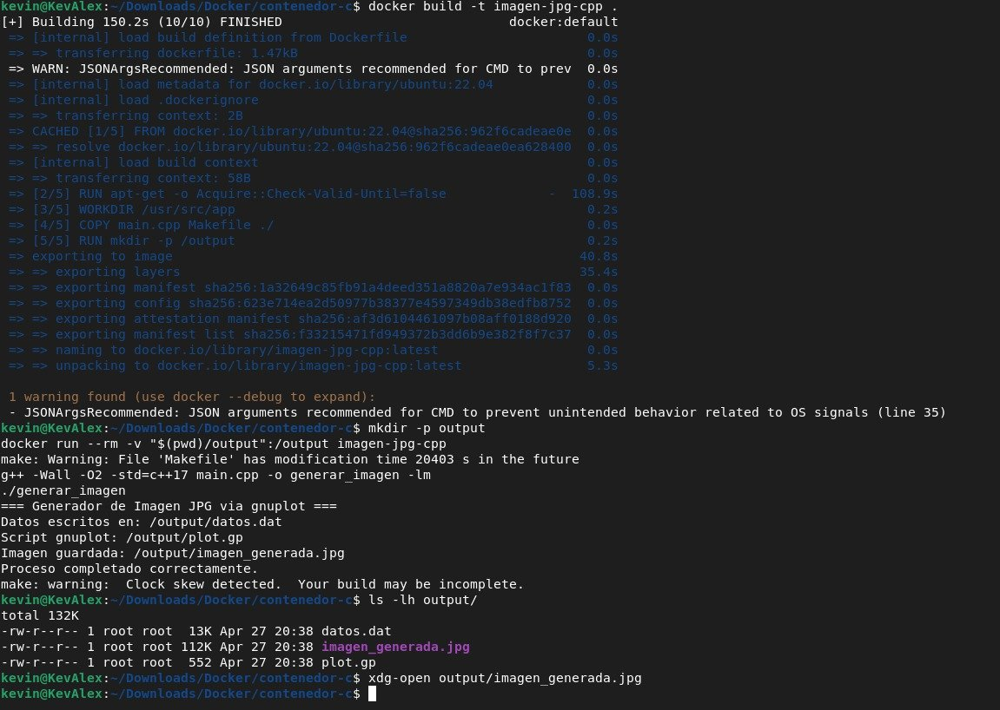
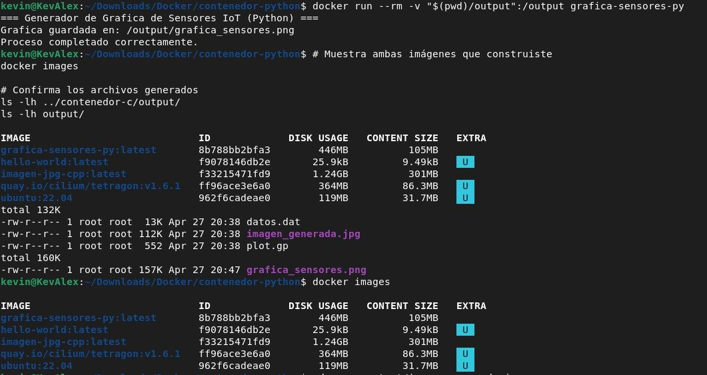
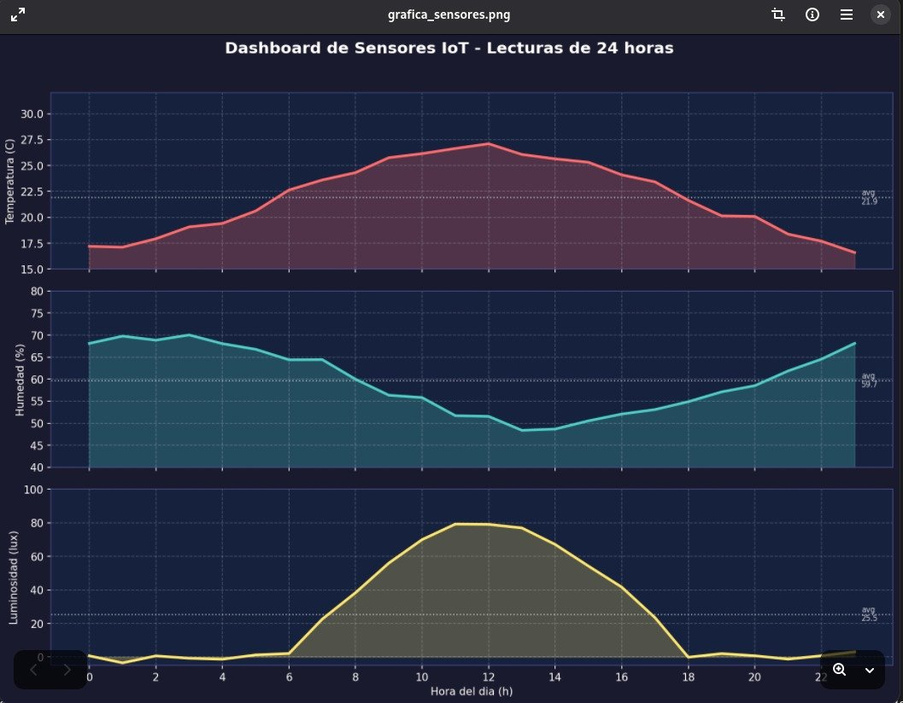

# Creación y Documentación de Contenedores Docker

> **Objetivo:** Crear y documentar contenedores Docker capaces de generar imágenes mediante procesos automatizados con `Makefile`.

---

## 1. Introducción a Docker

Docker es una plataforma que permite empaquetar aplicaciones junto con todas sus dependencias dentro de contenedores, garantizando portabilidad y consistencia.

A diferencia de las máquinas virtuales, los contenedores:

- No incluyen un sistema operativo completo.
- Comparten el kernel del host.
- Son más rápidos y ligeros.
- Facilitan la portabilidad entre entornos.

### Arquitectura

```
┌────────────────────────────────────────────────────────┐
│                        HOST OS                         │
│                                                        │
│   ┌──────────────┐        ┌─────────────────────────┐  │
│   │ Docker Client│        │      Contenedor         │  │
│   │   (docker)   │◄──────►│  ┌─────────────────┐    │  │
│   └──────────────┘        │  │   Aplicación    │    │  │
│                           │  ├─────────────────┤    │  │
│   ┌──────────────┐        │  │  Dependencias   │    │  │
│   │ Docker Daemon│◄──────►│  ├─────────────────┤    │  │
│   │  (dockerd)   │        │  │  Sistema base   │    │  │
│   └──────────────┘        │  └─────────────────┘    │  │
│                           └─────────────────────────┘  │
└────────────────────────────────────────────────────────┘
```

---

## 2. Conceptos Fundamentales

| Elemento | Descripción |
|----------|------------|
| Imagen | Plantilla inmutable con todo lo necesario |
| Contenedor | Instancia en ejecución de una imagen |
| Dockerfile | Script para construir imágenes |
| Volumen | Persistencia de datos |
| Red Docker | Comunicación entre contenedores |

### Flujo de trabajo

```
Dockerfile → docker build → docker run → resultados → repetir
```

---

## 3. Organización del Proyecto

```
docker-tarea/
├── README.md
├── .gitignore
│
├── contenedor-c/
│   ├── Dockerfile
│   ├── Makefile
│   └── main.cpp
│
├── contenedor-python/
│   ├── Dockerfile
│   ├── requirements.txt
│   └── generar_grafica.py
│
└── screenshots/
    ├── 01_build_cpp.png
    ├── 02_imagen_generada_jpg.png
    ├── 03_build_python.png
    ├── 04_run_python_docker_images.png
    ├── 05_grafica_sensores_png.png
    └── 06_imagen_generada_jpg2.png
```

---

## 4. Contenedor C++ → JPG

### Descripción

Programa en C++ que:

1. Genera datos matemáticos.
2. Crea un script de gnuplot.
3. Produce una imagen JPG.

### Herramientas usadas

- build-essential  
- g++  
- gnuplot  
- xdg-utils  
- libx11-dev  

### Flujo interno

```
main.cpp → compilación → ejecución →
datos.dat + plot.gp → gnuplot → imagen_generada.jpg
```

### Dockerfile

```dockerfile
FROM ubuntu:22.04

ENV DEBIAN_FRONTEND=noninteractive

RUN apt-get -o Acquire::Check-Valid-Until=false \
            -o Acquire::Check-Date=false \
            update && apt-get install -y \
        build-essential \
        g++ \
        gnuplot \
        xdg-utils \
        libx11-dev \
    && rm -rf /var/lib/apt/lists/*

WORKDIR /usr/src/app
COPY main.cpp Makefile ./
RUN mkdir -p /output

ARG MAKE_TARGET=all
ENV TARGET=${MAKE_TARGET}

CMD make ${TARGET}
```

### Makefile

```makefile
CXX      = g++
CXXFLAGS = -Wall -O2 -std=c++17
TARGET   = generar_imagen

all: $(TARGET) run

$(TARGET): main.cpp
	$(CXX) $(CXXFLAGS) main.cpp -o $(TARGET) -lm

run: $(TARGET)
	./$(TARGET)

clean:
	rm -f $(TARGET)
```

### Cómo ejecutar

```bash
cd contenedor-c

docker build -t imagen-jpg-cpp .

mkdir -p output
docker run --rm -v "$(pwd)/output":/output imagen-jpg-cpp

ls -lh output/
```

---

## 5. Contenedor Python → PNG

### Descripción

Simulación de sensores IoT durante 24 horas usando matplotlib y numpy.

### Sensores

| Sensor | Descripción |
|--------|------------|
| Temperatura | Curva senoidal |
| Humedad | Inversa |
| Luz | Activa de día |

### Dockerfile

```dockerfile
FROM python:3.11-slim

WORKDIR /app
COPY requirements.txt .
RUN pip install --no-cache-dir -r requirements.txt

COPY generar_grafica.py .
RUN mkdir -p /output

CMD ["python3", "generar_grafica.py"]
```

### Cómo ejecutar

```bash
cd contenedor-python

docker build -t grafica-sensores-py .

mkdir -p output
docker run --rm -v "$(pwd)/output":/output grafica-sensores-py
```

---

## 6. Comparación de Contenedores

| Característica | C++ | Python |
|--------------|-----|--------|
| Lenguaje | C++ | Python |
| Base | Ubuntu | Python slim |
| Gráficas | gnuplot | matplotlib |
| Salida | JPG | PNG |
| Uso | Compilación | Análisis |

---

## 7. Comandos Docker Útiles

```bash
docker images
docker ps
docker ps -a
docker rmi nombre
docker container prune
docker exec -it contenedor /bin/bash
docker logs contenedor
docker inspect imagen
```

---

## 8. Evidencia de Ejecución

### Build C++



---

### Imagen generada JPG


---

### Build Python


---

### Imágenes Docker



---

### Gráfica sensores PNG



---

### Imagen completa JPG


---

## 9. Buenas Prácticas

- Uso de `--rm` para contenedores temporales  
- Uso de volúmenes (`-v`) para persistencia  
- Exclusión de binarios con `.gitignore`  
- Limpieza de caché en Dockerfiles  
- Uso de `ARG` para flexibilidad en build  