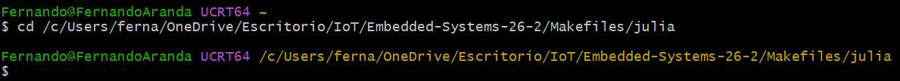
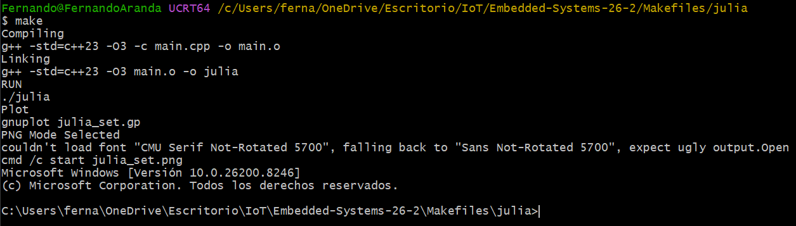
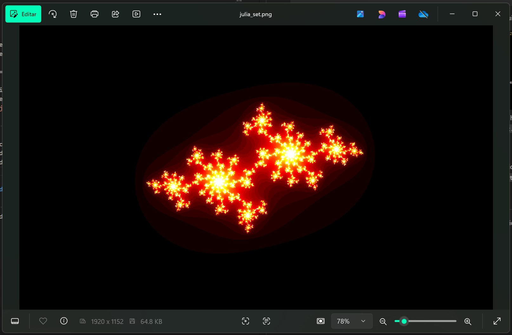
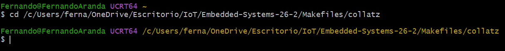

# Uso y documentación de Makefiles

## Descripción

En el desarrollo de este ejercicio se explica la estructura y el uso de los archivos ```Makefile``` para la estandarización de **procesos de compilación y ejecución**. Así mismo se describe y documenta su ejecución y funcionamiento mediante dos ejemplos.

---

## Objetivos

- Identificar y comprender la estructura básica de un ``Makefile`` y su función en la automatización de proyectos.
- Explicar cómo un ``Makefile`` ayuda a estandarizar procesos de compilación.
- Crear un ``Makefile`` propio, documentarlo y organizarlo en un repositorio personal.
- Describir el `funcionamiento` del código del ``Makefile``, reportando resultados de ejecución y explicando cómo se logra la automatización.

---

## 1. Ejemplo de prueba

Primeramente se realiza la prueba con el archivo Make incluido en la carpeta `jilia` del repositorio proporcionado en las especificaciones de este ejercicio.

El código del archivo `main.cpp` es el siguiente:

```cpp
#include <cmath>
#include <complex>
#include <iomanip>
#include <iostream>
#include <fstream>

double mandelbrot (const double& real, const double& imag) {
  
  // (-0.70176) (-0.3842)
  // (-0.835)  (-0.2321)
  // (0.4)  (-0.325)
  double z_real = real;
  double z_imag = imag;

  int iter = 45;
  double max_iter = static_cast<double>(iter);

  double zn_real; double zn_imag;
  for (int n = 0; n < iter; n++) {

    zn_real = (z_real * z_real) - (z_imag * z_imag) + (-0.70176);
    zn_imag = 2.0 * z_real * z_imag + (-0.3842);

    if ( zn_real*zn_real + zn_imag*zn_imag > 4.0 ) {
      return static_cast<double>(n);
    }

    z_real = zn_real;
    z_imag = zn_imag;

  }

  return max_iter;
}

int main(int argc, char** argv) {
  double x0 = -0.0;
  double r = 1.8;
  double points = 500;

  std::string filename = "julia_set.txt";
  std::ofstream outfile;
  outfile.open(filename);

  // Set fixed-point notation and precision
  outfile << std::fixed << std::setprecision(5);

  for (double y = -r; y < r; y += (r+r)/(points-1.0)) {
    for (double x = x0-r; x < x0+r; x += (r+r)/(points-1.0)) {
      outfile << std::setw(8) << x << ", " 
              << std::setw(8) << y << ", " 
              << std::setw(8) <<  mandelbrot(x,y) <<
              std::endl;

    }
    outfile << std::endl;
  }

  outfile.close();

  return 0;
}
```

Este programa en ``C++`` genera los datos necesarios para visualizar un ``conjunto de Julia``, una estructura matemática asociada a los fractales. Define una función que, para cada punto del plano complejo (x,y), aplica iterativamente una fórmula cuadrática y mide cuántas iteraciones tarda en “escapar” (es decir, cuando su magnitud supera cierto límite). En el main, recorre una malla de puntos en un rango definido, evalúa cada uno con esa función y guarda los resultados en el archivo de texto ``julia_set.txt`` con formato ordenado, el cual se utiliza para dibujar la gráfica generada en el archivo ``julia_set.png``.

Por otra parte, el código de ``Makefile`` tiene la siguiente estructura:

```make
# Variables 
CXX = g++
CXXFLAGS = -std=c++23 -O3

GP = julia_set.gp 
TXT = $(GP:.gp=.txt)
PNG = $(GP:.gp=.png)

SRCS = main.cpp

OBJS = $(SRCS:.cpp=.o)

APP  = julia

## TARGETS

all: run plot open 

.PHONY: vars
vars:
	@echo "print variables"
	@echo "SRCS = $(SRCS)"
	@echo "OBJS = $(OBJS)"
	@echo "PRE  = $<"
	@echo "NAME = $@"
	@echo "GP   = $(GP)"
	@echo "TXT  = $(TXT)"

%.o: %.cpp
	@echo "Compiling"
	$(CXX) $(CXXFLAGS) -c $< -o $@

$(APP): $(OBJS)
	@echo "Linking"
	$(CXX) $(CXXFLAGS) $(OBJS) -o $(APP)

run: $(APP)
	@echo "RUN"
	./$(APP)

plot: $(TXT)
	@echo "Plot"
	gnuplot $(GP)

open:
	@echo "Open"
	xdg-open $(PNG) &

clean: 
	rm *.o $(APP) *.txt *.png
```

Este cuenta con varios bloques clave. Se procede con su explicación.

**Variables**

```make
# Variables 
CXX = g++
CXXFLAGS = -std=c++23 -O3

GP = julia_set.gp 
TXT = $(GP:.gp=.txt)
PNG = $(GP:.gp=.png)

SRCS = main.cpp
OBJS = $(SRCS:.cpp=.o)

APP  = julia
```

Definen todos los elementos del proyecto:

- ``CXX``: compilador de C++.
- ``CXXFLAGS``: estándar y optimización.
- ``GP``: archivo de script para graficar.
- ``TXT``, ``PNG``: nombres derivados automáticamente.
- ``SRCS``, ``OBJS``: archivos fuente y objetos.
- ``APP``: ejecutable final.

**Objetivo principal**

```make
all: run plot open 
```

Indica que al ejecutar el ``make``, se hará todo el flujo:

1. Compliar y ejecutar.
2. Generar gráfica.
3. Abrir imagen

**Depuración / inspección**

```make
.PHONY: vars
vars:
	@echo "print variables"
	@echo "SRCS = $(SRCS)"
	@echo "OBJS = $(OBJS)"
	@echo "PRE  = $<"
	@echo "NAME = $@"
	@echo "GP   = $(GP)"
	@echo "TXT  = $(TXT)"
```

Muestra valores de variables automáticas:

- ``$<``: primera dependencia.
- ``$@``: nombre del objetivo.

**Regla genérica de compilación**

```make
%.o: %.cpp
	@echo "Compiling"
	$(CXX) $(CXXFLAGS) -c $< -o $@
```

Convierte cualquier ``.cpp`` en ``.o``:

- ``$<``: archivo fuente.
- ``$@``: archivo objeto.

**Enlazado**

```make
$(APP): $(OBJS)
	@echo "Linking"
	$(CXX) $(CXXFLAGS) $(OBJS) -o $(APP)
```

Genera el ejecutable (``julia``) a partir de los objetos.

**Ejecución del programa**

```make
run: $(APP)
	@echo "RUN"
	./$(APP)
```

Asegura que el ejecutable exista y luego lo ejecuta.

**Generación de gráfica**

```make
plot: $(TXT)
	@echo "Plot"
	gnuplot $(GP)
```

Usa ``Gnuplot`` para crear una imagen a partir del script ``.gp``.

**Visualización del resultado**

```make
open:
	@echo "Open"
	cmd /c start $(PNG)
```

Abre la imagen generada automáticamente.

**Limpieza**

```make
clean: 
	rm *.o $(APP) *.txt *.png
```

Elimina todos los archivos generados:

- Objetos.
- Ejecutable.
- Archivos intermedios y gráficos.

Esto permite recompilar desde cero.

---

### Funcionamiento

> **Importante:** se está utilizando la terminal ``MYSYS2 UCRT64`` desde Windows.

#### 1.1 Acceder desde la terminal al directorio en el que se encuentra el archivo ``make`` con el que se trabajará.



Dentro de esta carpeta se encuentra el Makefile y el archivo `main.cpp`, el cual se compilará y ejecutará enseguida.

#### 1.2 Compilación y ejecución del archivo main.cpp a partir del archivo Makefile

Ejecutar el siguiente comando desde la terminal:

```bash
make
```

Una vez ejecutado el comando indicado, en la terminal se desplegrá el siguiente mensaje:



Esto indica que el archivo ``main.cpp`` fue compilado y ejecutado exitosamente, habiendo sido creados los archivos `main.o`, `julia.exe`, ``julia_set.txt`` y ``julia_set.png``.

#### 1.3 Grafica del conjunto de Julia

La ejecución del programa abre el archivo ``julia_set.png``, que es la gráfica del conjunto Julia generada a partir de los valores almacenados en el archivo ``julia_set.txt``.



Y es así como se presenta el funcionamiento de un archivo ``make`` utilizado para compilar y ejecutar un programa en ``c++``.

---

## 2. Ejemplo propuesto

Una vez descrito y analizado el programa anterior, se procede con la propuesta de otro ejercicio. En este caso se hará uso de un archivo ``make`` para compilar y ejecutar un programa escrito en ``c++`` que realiza el cálculo de la ``conjetura de collatz`` y genera una visualización de forma tipo fractal mediante ``gnuplot``.

El código del programa ``main.cpp`` es el siguiente:

```cpp
#include <complex>
#include <fstream>
#include <iomanip>
#include <iostream>
#include <numbers>

using namespace std;

complex<double> collatz_complex(complex<double> z) {
    return (z / 2.0) * (1.0 + cos(std::numbers::pi * z)) / 2.0 +
           (3.0 * z + complex<double>(1.0, 0.0)) * (1.0 - cos(std::numbers::pi * z)) / 2.0;
}

// Iteraciones hasta escape
int collatz_fractal(complex<double> z0) {
    complex<double> z = z0;
    int max_iter = 500;

    for (int i = 0; i < max_iter; i++) {
        z = collatz_complex(z);

        if (abs(z) > 60.0) {
            return i;
        }
    }
    return max_iter;
}

int main() {
    int width = 800;
    int height = 800;

    double xmin = -2.0, xmax = 2.0;
    double ymin = -2.0, ymax = 2.0;

    ofstream file("collatz.txt");
    file << fixed << setprecision(6);

    for (int j = 0; j < height; j++) {
        for (int i = 0; i < width; i++) {

            double x = xmin + (xmax - xmin) * i / (width - 1);
            double y = ymin + (ymax - ymin) * j / (height - 1);

            complex<double> z(x, y);
            int value = collatz_fractal(z);

            file << x << " " << y << " " << value << "\n";
        }
        file << "\n";
    }

    file.close();
    return 0;
}
```

Este programa genera los datos necesarios para visualizar un fractal basado en una extensión de la ``conjetura de Collatz`` al plano complejo. Para ello, define una función que combina de forma continua los comportamientos de la regla de Collatz (dividir entre 2 o multiplicar por 3 y sumar 1) mediante el uso del coseno con el valor de π, permitiendo trabajar con números complejos. Luego, para cada punto de una malla bidimensional dentro del rango [−2,2] en ambos ejes, itera esta función hasta un número máximo de veces o hasta que el valor diverge (supera cierta magnitud). El número de iteraciones necesarias para escapar se utiliza como indicador y se guarda junto con las coordenadas del punto en el archivo ``collatz.txt``. Este archivo posteriormente se emplea para graficar el fractal en la imagen ``collatz.png``.

El archivo ``MakeFile`` utilizado para la compilación y ejecución del programa es el siguiente:

```make
# Variables 
CXX = g++
CXXFLAGS = -std=c++23 -O3

GP = collatz.gp 
TXT = $(GP:.gp=.txt)
PNG = $(GP:.gp=.png)

SRCS = main.cpp
OBJS = $(SRCS:.cpp=.o)

APP  = collatz

## TARGETS

all: run plot open 

.PHONY: vars
vars:
	@echo "print variables"
	@echo "SRCS = $(SRCS)"
	@echo "OBJS = $(OBJS)"
	@echo "PRE  = $<"
	@echo "NAME = $@"
	@echo "GP   = $(GP)"
	@echo "TXT  = $(TXT)"

%.o: %.cpp
	@echo "Compiling"
	$(CXX) $(CXXFLAGS) -c $< -o $@

$(APP): $(OBJS)
	@echo "Linking"
	$(CXX) $(CXXFLAGS) $(OBJS) -o $(APP)

$(TXT): $(APP)
	@echo "Generating data"
	./$(APP)

run: $(APP)
	@echo "RUN"
	./$(APP)

plot: $(TXT)
	@echo "Plot"
	gnuplot $(GP)

open:
	@echo "Open"
	-explorer.exe "$(shell cygpath -w $(PNG))"

clean: 
	rm *.o $(APP) *.txt *.png
```

**Variables**

```make
CXX = g++
CXXFLAGS = -std=c++23 -O3

GP = collatz.gp 
TXT = $(GP:.gp=.txt)
PNG = $(GP:.gp=.png)

SRCS = main.cpp
OBJS = $(SRCS:.cpp=.o)

APP  = collatz
```

- Define el compilador y las banderas.
- Usa sustituciones automáticas para generar ``.txt``, ``.png`` y ``.o``.
- Centraliza los nombres de archivos.

**Objetivo principal**

```make
all: run plot open 
```

Es el objetivo por defecto (``make``). Ejecuta todo el flujo:
1. correr programa
2. graficar
3. abrir imagen

**Depuración / inspección**

```make
.PHONY: vars
vars:
	@echo "print variables"
	@echo "SRCS = $(SRCS)"
	@echo "OBJS = $(OBJS)"
	@echo "PRE  = $<"
	@echo "NAME = $@"
	@echo "GP   = $(GP)"
	@echo "TXT  = $(TXT)"
```

Muestra valores de variables automáticas (``$<``, ``$@``).

**Regla genérica de compilación**

```make
%.o: %.cpp
	@echo "Compiling"
	$(CXX) $(CXXFLAGS) -c $< -o $@
```

Regla patrón para compilar ``.cpp`` → ``.o``.
- ``$<`` = archivo fuente.
- ``$@`` = archivo destino.

**Enlazado**

````make
$(APP): $(OBJS)
	@echo "Linking"
	$(CXX) $(CXXFLAGS) $(OBJS) -o $(APP)
````

Une los ``.o`` para crear el ejecutable. Se trata del paso final de compilación.

**Genración de datos**

```make
$(TXT): $(APP)
	@echo "Generating data"
	./$(APP)
```

Genera el archivo ``.txt`` ejecutando el programa y define la dependencia clave: ``datos ← ejecutable``.

**Ejecución del programa**

```make
run: $(APP)
	@echo "RUN"
	./$(APP)
```

Ejecuta el programa manualmente.

**Generación del gráfico**

```make
plot: $(TXT)
	@echo "Plot"
	gnuplot $(GP)
```

Se usa Gnuplot para generar la imagen. Este paso depende de que exista el ``.txt``.

**Visualización del resultado**

```make
open:
	@echo "Open"
	-explorer.exe "$(shell cygpath -w $(PNG))"
```

Se abre la imagen generada tras la ejecución.

**Limpieza**

```make
clean: 
	rm *.o $(APP) *.txt *.png
```

Elimina todos los archivos generados y permite recompilar desde cero.

---

### Funcionamiento

#### 2.1 Acceder desde la terminal al directorio en el que se encuentra el archivo ``make``.



Dentro de esta carpeta se encuentra el Makefile y el archivo `main.cpp`.

#### 2.2 Compilación y ejecución del archivo main.cpp a partir del archivo Makefile

Ejecutar el siguiente comando desde la terminal:

```bash
make
```

Una vez ejecutado el comando indicado, en la terminal se despliegrá lo siguiente:


Esto indica que la compilación y ejecución de ``main.cpp`` fue exitosa, creándose así los archivos `main.o`, `collatz.exe`, ``collatz.txt`` y ``collatz.png``.

#### 2.3 Gráfica de la conjetura de Collatz

La ejecución hace que se abra el archivo ``collatz.png``, que es el gráfico de la conjetura de Collatz generado a partir de los valores almacenados en el archivo ``collatz.txt``.

