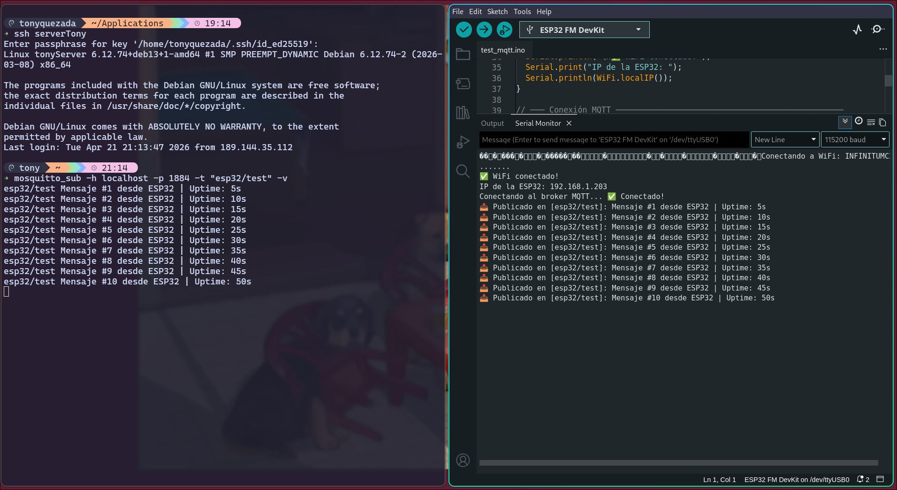

# Mosquitto MQTT en Raspberry Pi con ESP32 (Publisher)

## Descripción

En esta práctica se instala y configura **Mosquitto MQTT** directamente en una Raspberry Pi (sin Docker).  
Además, se programa una **ESP32** para que funcione como *publisher*, enviando mensajes cada cierto tiempo al broker.

> **Importante:** Esta Raspberry Pi ya tiene Mosquitto corriendo en Docker en el puerto **1883**, así que aquí usaremos el **1884** para no tener problemas.

---

## Objetivos

- Entender cómo funciona MQTT en aplicaciones IoT.
- Instalar Mosquitto de forma nativa en Raspberry Pi.
- Hacer que una ESP32 envíe mensajes a un broker MQTT.
- Documentar todo correctamente en GitHub.
- Ver cómo se comunican dispositivos reales en una red.

---

## Requisitos

| Componente | Detalle |
|---|---|
| Hardware | Raspberry Pi (con Raspberry Pi OS) |
| Hardware | ESP32 |
| Software | Raspberry Pi OS actualizado |
| Software | Arduino IDE |
| Red | Ambos dispositivos en la misma red |

---

## 1: Instalación de Mosquitto

### 1.1 Actualizar el sistema

Primero, como siempre, actualizamos todo:

```bash
sudo apt update && sudo apt upgrade -y
```

### 1.2 Instalar Mosquitto

```bash
sudo apt install -y mosquitto mosquitto-clients
```

Para verificar:

```bash
mosquitto --version
```

---

### 1.3 Configurar puerto 1884

Como el 1883 ya está ocupado, creamos una config nueva:

```bash
sudo nano /etc/mosquitto/conf.d/custom.conf
```

Y agregamos:

```conf
listener 1884
allow_anonymous true
log_dest file /var/log/mosquitto/mosquitto.log
log_type all
```

Guardar con `Ctrl + O`, Enter, y salir con `Ctrl + X`.

---

### 1.4 Iniciar el servicio

```bash
sudo systemctl enable mosquitto
sudo systemctl start mosquitto
sudo systemctl status mosquitto
```

Debe aparecer como activo (`running`).

---

### 1.5 Verificar puerto

```bash
sudo ss -tlnp | grep 1884
```

Si todo salió bien, Mosquitto estará escuchando en ese puerto.

---

## 2: Prueba rápida

Abre dos terminales.

### Terminal 1 (Subscriber)

```bash
mosquitto_sub -h localhost -p 1884 -t "esp32/test" -v
```

---

### Terminal 2 (Publisher)

```bash
mosquitto_pub -h localhost -p 1884 -t "esp32/test" -m "Hola desde la Raspberry Pi"
```

---

### Resultado esperado

En la primera terminal deberías ver:

```
esp32/test Hola desde la Raspberry Pi
```

Si aparece, todo va bien.

---

## 3: ESP32 como Publisher

### 3.1 Configurar Arduino IDE

1. Instalar Arduino IDE 2.x  
2. Agregar en preferencias:

```
https://raw.githubusercontent.com/espressif/arduino-esp32/gh-pages/package_esp32_index.json
```

3. Instalar ESP32 desde Boards Manager

---

### 3.2 Librería necesaria

Instalar:

- `PubSubClient` (de Nick O'Leary)

---

### 3.3 Obtener IP de la Raspberry

```bash
hostname -I
```

Ejemplo: `192.168.1.100`

---

### 3.4 Código ESP32

```cpp
#include <WiFi.h>
#include <PubSubClient.h>

// WiFi
const char* WIFI_SSID     = "TU_RED_WIFI";
const char* WIFI_PASSWORD = "TU_CONTRASEÑA";

// MQTT
const char* MQTT_BROKER_IP = "192.168.1.100";
const int   MQTT_PORT      = 1884;
const char* MQTT_CLIENT_ID = "ESP32_Publisher";
const char* MQTT_TOPIC     = "esp32/test";

const long PUBLISH_INTERVAL = 5000;

WiFiClient espClient;
PubSubClient mqttClient(espClient);

unsigned long lastPublishTime = 0;
int messageCount = 0;

void connectWiFi() {
  Serial.print("Conectando a WiFi...");
  WiFi.begin(WIFI_SSID, WIFI_PASSWORD);

  while (WiFi.status() != WL_CONNECTED) {
    delay(500);
    Serial.print(".");
  }

  Serial.println("\nConectado");
}

void connectMQTT() {
  while (!mqttClient.connected()) {
    Serial.print("Conectando a MQTT...");

    if (mqttClient.connect(MQTT_CLIENT_ID)) {
      Serial.println("OK");
    } else {
      Serial.println("Error, reintentando...");
      delay(5000);
    }
  }
}

void setup() {
  Serial.begin(115200);
  connectWiFi();
  mqttClient.setServer(MQTT_BROKER_IP, MQTT_PORT);
}

void loop() {
  if (!mqttClient.connected()) {
    connectMQTT();
  }

  mqttClient.loop();

  unsigned long now = millis();
  if (now - lastPublishTime >= PUBLISH_INTERVAL) {
    lastPublishTime = now;
    messageCount++;

    String payload = "Mensaje #" + String(messageCount) +
                     " | Uptime: " + String(now / 1000) + "s";

    mqttClient.publish(MQTT_TOPIC, payload.c_str());

    Serial.println(payload);
  }
}
```

---

### 3.5 Subir código

1. Conectar ESP32
2. Seleccionar placa y puerto
3. Upload
4. Abrir monitor serial (115200)

---

## 4: Verificación final

En la Raspberry:

```bash
mosquitto_sub -h localhost -p 1884 -t "esp32/test" -v
```

Deberías ver mensajes como:

```
esp32/test Mensaje #1 | Uptime: 5s
esp32/test Mensaje #2 | Uptime: 10s
```

Si ves eso, ya quedó funcionando todo.

---

## 5: Evidencia

### Instalación Mosquitto


---

### Test publisher


---

### ESP32
